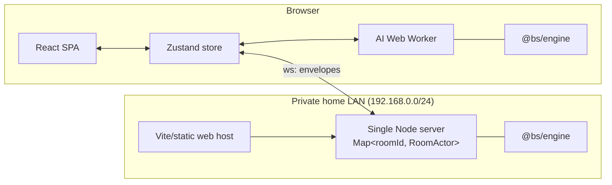
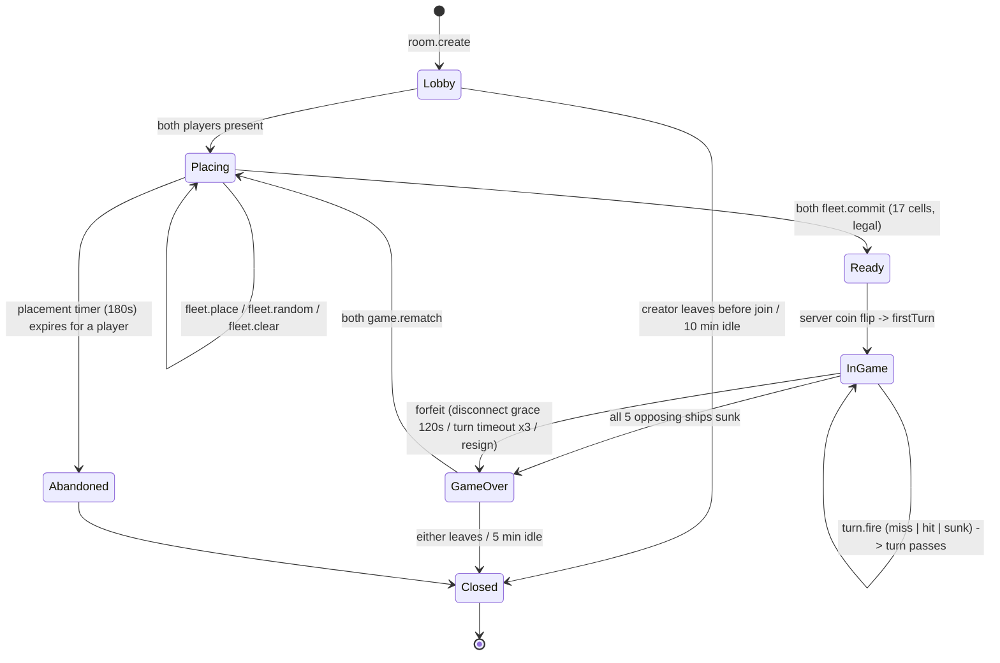
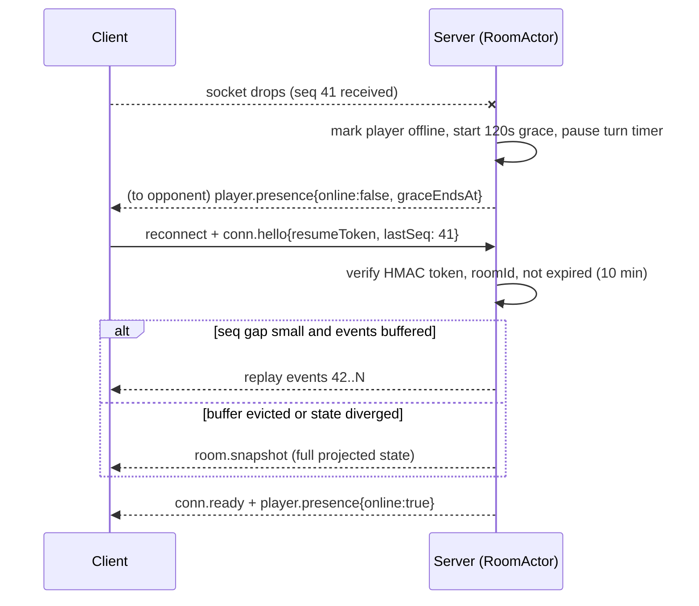

# 2. System Architecture & State Machine

## 2.1 Process topology



**Single-player never touches the right-hand side of this diagram.** Selecting
"vs Computer" instantiates a local `RoomActor` inside the Web Worker running the exact
same reducer the server runs. The UI cannot tell the difference: both are behind a
`Transport` interface (§2.4). Consequence: single-player works offline, has zero
latency, and costs nothing to operate.

## 2.2 The room actor

A room is an actor: one owner process, one mailbox, strictly serialized command
processing.

```ts
// apps/server/src/room/RoomActor.ts
export class RoomActor {
  private state: RoomState;                  // authoritative, full information
  private readonly conns = new Map<PlayerId, Connection>();
  private readonly queue: QueuedCommand[] = [];
  private draining = false;
  private seq = 0;
  private readonly seen = new Map<CmdId, ServerEvent[]>();  // idempotency, TTL 60s

  /** The ONLY mutation entry point. Never call reduce() from anywhere else. */
  async submit(from: PlayerId, cmd: Command, cmdId: CmdId): Promise<void> {
    const replay = this.seen.get(cmdId);
    if (replay) return this.sendTo(from, replay);   // exactly-once from the client's POV

    this.queue.push({ from, cmd, cmdId });
    if (this.queue.length > 1) return;              // a drain loop is already running
    while (this.queue.length) {
      const item = this.queue[0];
      this.step(item);
      this.queue.shift();
    }
  }

  private step({ from, cmd, cmdId }: QueuedCommand): void {
    const result = reduce(this.state, { ...cmd, actor: from });
    if (!result.ok) {
      this.emitTo(from, { type: 'error', code: result.code, detail: result.detail, cmdId });
      return;
    }
    this.state = result.state;
    const events = result.events.map((e) => ({ ...e, seq: ++this.seq }));
    this.seen.set(cmdId, events);
    for (const [pid, conn] of this.conns) {
      conn.send(events.map((e) => project(e, this.state, pid)).filter(Boolean));
    }
    this.persistSnapshotDebounced();
  }
}
```

Properties this buys:

- **No shot races.** Two simultaneous `turn.fire` commands are serialized by the queue;
  the second is rejected by the turn guard, not by a lock.
- **Idempotency at the boundary.** A client that retries after an ambiguous disconnect
  gets the original events replayed, not a second shot.
- **One audit point.** `reduce` is pure and `project` is the only serializer. Both are
  exhaustively tested in isolation.

## 2.3 Room ownership — ADR-07

Game state lives in the single LAN server process. `POST /api/rooms` creates an actor in its
in-process registry. `GET /api/rooms` returns summaries of one-player lobbies so another trusted
LAN browser can choose a room by its creator's name; it returns only `{ code, creatorName, createdAt }`,
never player IDs, resume tokens, fleets, or game state. Joining clients connect directly to that
same server. There is no directory, proxy, Redis, or cross-instance protocol.

Waiting rooms are deliberately short-lived: the creator can close one explicitly, a disconnected
creator has a 60-second reconnect grace period, and an untouched one-player lobby expires after
ten minutes. Active matches use the engine's 120-second reconnect grace period. The actor marks a
player offline, pauses shots and the authoritative turn timer, then awards a timeout loss if that
player does not return.

Active rooms end if that server restarts. This is an intentional tradeoff for a private home
game; the pure engine and room actor can later gain a local persistence adapter without changing
the rules or browser protocol.

## 2.4 Transport abstraction

```ts
// packages/protocol/src/transport.ts
export interface Transport {
  send(cmd: ClientCommand): void;
  onEvent(handler: (e: ServerEvent) => void): () => void;
  readonly status: 'connecting' | 'open' | 'resuming' | 'closed';
}
```

Two implementations, one consumer:

- `RemoteTransport` — multiplayer; handles reconnect with bounded exponential backoff
  (500 ms → 8 s, six attempts) and resume.
- `LocalTransport` — single-player; posts to the Web Worker, which owns a `RoomActor`
  and an `AiPlayer`. Identical envelopes, `seq` included, so replay tests are shared.

This is why single-player required no special-casing anywhere in the UI layer.

## 2.5 Game lifecycle state machine



Encoded as a discriminated union so illegal states are unrepresentable:

```ts
// packages/engine/src/state.ts
export type Phase =
  | { kind: 'lobby' }
  | { kind: 'placing'; deadline: number }
  | { kind: 'ready' }
  | { kind: 'in_game'; turn: PlayerId; turnDeadline: number; turnNo: number }
  | { kind: 'game_over'; winner: PlayerId; reason: 'sunk_all' | 'forfeit' | 'timeout' }
  | { kind: 'closed'; reason: string };
```

Note `turn` exists only inside `in_game`. There is no way to read the turn owner during
placement, so no code path can accidentally branch on a stale turn value.

### Transition table (authoritative)

| From | Command | Guards (all must hold) | To | Emitted events |
|---|---|---|---|---|
| `lobby` | `room.join` | room not full; code valid | `lobby` → `placing` when 2 present | `player.joined`, `phase.changed` |
| `placing` | `fleet.place` | actor has not committed; placement legal (§4.1) | `placing` | `fleet.updated` (actor only) |
| `placing` | `fleet.commit` | all 5 ships placed; 17 cells; no overlap/adjacency | `placing` → `ready` when both | `fleet.committed`, `phase.changed` |
| `ready` | *(auto)* | both committed | `in_game` | `game.started{firstTurn}`, `turn.began` |
| `in_game` | `turn.fire` | `phase.turn === actor`; cell in range; cell not previously fired by actor | `in_game` or `game_over` | `shot.result`, optional `ship.sunk`, `turn.began` \| `game.over` |
| `in_game` | `player.resign` | — | `game_over` | `game.over{reason:'forfeit'}` |
| `in_game` | *(timer)* | 3 consecutive turn timeouts | `game_over` | `game.over{reason:'timeout'}` |
| `game_over` | `game.rematch` | both request within 5 min | `placing` | `phase.changed`, fleets cleared, first turn alternates |
| *any* | `room.leave` | — | `closed` (or `game_over` if in play) | `player.left` |

**Turn does not pass on a hit.** This is a rules choice; the standard tournament rule is
that a player fires once per turn regardless of outcome. It is a single constant:
`RULES.extraTurnOnHit = false`, surfaced as a room option so a "salvo/chain" variant is
a config change, not a fork.

## 2.6 Authoritative validation invariants

The server rejects, never trusts:

1. **Identity.** `actor` is taken from the authenticated connection, never from the
   message body. A message containing `playerId` is a protocol violation and closes the
   socket.
2. **Turn ownership.** `phase.kind === 'in_game' && phase.turn === actor`.
3. **Placement legality.** Re-validated server-side even though the client validated it.
   The client's validation is a UX affordance, not a security control.
4. **Shot legality.** Cell in `[0,99]`; `!(actorShots & bit(cell))`.
5. **Rate.** Token bucket per connection (§7.4).
6. **Phase.** Every command carries an allowed-phase set; anything else returns
   `E_WRONG_PHASE` without touching state.

A rejected command produces **no state mutation and no `seq` increment**, so a
misbehaving client cannot desynchronize its opponent.

## 2.7 WebSocket event protocol

### Envelope

```ts
// packages/protocol/src/envelope.ts
export interface ClientEnvelope<T extends ClientCommand = ClientCommand> {
  v: 1;                 // protocol version; mismatch -> E_VERSION and close(4426)
  cmdId: string;        // ULID, client-generated, idempotency key
  type: T['type'];
  payload: T['payload'];
}

export interface ServerEnvelope<T extends ServerEvent = ServerEvent> {
  v: 1;
  seq: number;          // monotonic per room; gaps mean the client must resync
  ts: number;           // server epoch ms, for latency estimation and animation sync
  type: T['type'];
  payload: T['payload'];
  cmdId?: string;       // echoed for the command that caused this event
}
```

### Client → Server

| `type` | Payload | Notes |
|---|---|---|
| `conn.hello` | `{ clientVersion, resumeToken? }` | First frame. Must arrive within 5 s or the socket closes |
| `room.create` | `{ mode: 'private' \| 'public', rules?: RuleOverrides }` | |
| `room.join` | `{ code: string }` | Rate-limited; see §7.4 |
| `fleet.place` | `{ shipId, bow: Cell, dir: 'H' \| 'V' }` | `bow` = topmost/leftmost cell |
| `fleet.random` | `{}` | Server-side seeded random legal fleet |
| `fleet.clear` | `{ shipId? }` | Omit `shipId` to clear all |
| `fleet.commit` | `{ checksum: string }` | `checksum` = SHA-256 of the canonical fleet; detects client/server drift |
| `turn.fire` | `{ cell: Cell }` | `Cell` is `0..99`, `row * 10 + col` |
| `player.resign` | `{}` | |
| `game.rematch` | `{ accept: boolean }` | |
| `emote.send` | `{ id: EmoteId }` | Fixed enum (ADR-09), no free text |
| `conn.ping` | `{ t: number }` | Client clock; server echoes for RTT |

### Server → Client

| `type` | Payload | Recipients |
|---|---|---|
| `conn.ready` | `{ playerId, roomCode, resumeToken, serverTime }` | actor |
| `room.snapshot` | `ProjectedRoomState` (§3.5) | actor; sent on join and on resume |
| `player.joined` / `player.left` | `{ playerId, displayName }` | both |
| `player.presence` | `{ playerId, online, graceEndsAt? }` | both |
| `phase.changed` | `{ phase: ProjectedPhase }` | both |
| `fleet.updated` | `{ ships: OwnShip[] }` | **owner only** |
| `fleet.committed` | `{ playerId }` | both (no cells) |
| `game.started` | `{ firstTurn, turnDeadline }` | both |
| `turn.began` | `{ turn, turnNo, deadline }` | both |
| `shot.result` | `{ by, cell, outcome: 'miss' \| 'hit' \| 'sunk', shipKind?, sunkCells? }` | both |
| `game.over` | `{ winner, reason, reveal: { [playerId]: Ship[] } }` | both — the **only** message that reveals boards |
| `emote.recv` | `{ from, id }` | both |
| `error` | `{ code, detail?, cmdId? }` | actor |
| `server.draining` | `{ reconnectAfterMs }` | both |
| `conn.pong` | `{ t, serverTime }` | actor |

`shipKind` and `sunkCells` are populated **only** on `outcome: 'sunk'` — that is standard
Battleship (the sinking is announced), and it is the only information leak the rules
require. See [§4.2](./04-core-algorithms.md#42-fog-of-war-projection).

### Error codes

`E_VERSION`, `E_AUTH`, `E_ROOM_NOT_FOUND`, `E_ROOM_FULL`, `E_WRONG_PHASE`,
`E_NOT_YOUR_TURN`, `E_ILLEGAL_PLACEMENT`, `E_ALREADY_FIRED`, `E_RATE_LIMIT`,
`E_MALFORMED`, `E_INTERNAL`. Close codes: `4400` malformed, `4401` auth, `4408` hello
timeout, `4426` version mismatch, `4429` rate limit.

## 2.8 Reconnection and resume



- **Resume token**: `base64url(playerId . roomId . exp) || HMAC-SHA256(secret, ...)`.
  Stateless, 10-minute expiry, verified in constant time. Stored in `sessionStorage`
  (not `localStorage`: it should not survive a closed tab, and it must not be shared
  across tabs which would let one player open two sockets to the same seat).
- **Grace window 120 s.** The turn timer is paused while a player is in grace, so a
  disconnect cannot be used to run the opponent's clock down; the disconnected player's
  own clock keeps running. Expiry → forfeit.
- The server retains the last 256 events per room for delta replay; beyond that it sends
  a snapshot. A full snapshot is ~1.5 KB, so this threshold is generous.
